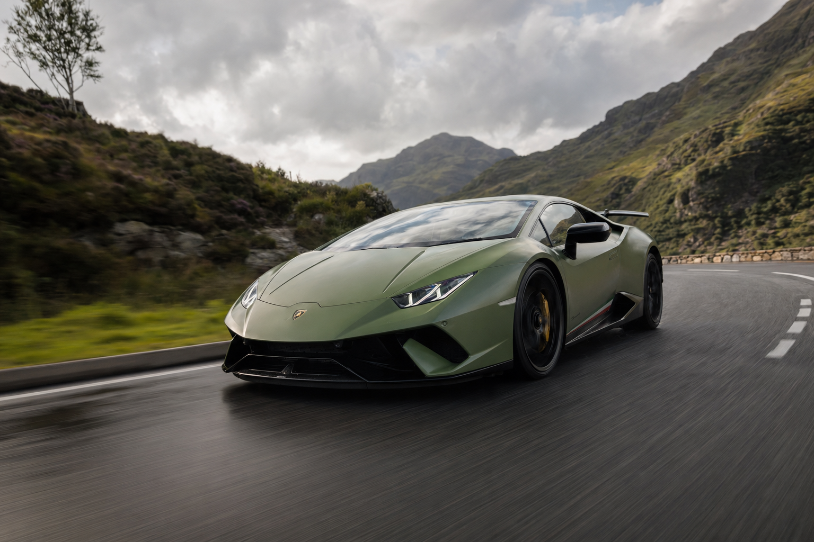

# PUSHING CREATION_



Cinematic prompt methodology you can install into Claude Code. Author **style packs** and **storyboards** that produce professional-grade AI-generated images and video, across any provider, any tool.

> Stop prompting. Start defining outcomes.

## Generate directly from Claude (v0.3+)

Install pushing-creation, add your provider keys to Keychain once, then `/frames-gen <shot>` inside any Claude Code session writes the image to disk. Claude never sees your keys. Seven providers supported.

See [docs/KEYCHAIN_SETUP.md](docs/KEYCHAIN_SETUP.md) for setup instructions.


## Install (Claude Code)

```
git clone https://github.com/PUSHINGSQUARES/pushing-creation.git
cd pushing-creation
```

Claude Code picks up the skill automatically. Type `/frames-new my-project` to scaffold your first project.

## Install (Claude.ai web)

Open a Claude Project. Paste the contents of `INSTALL_WITH_CLAUDE.md` into the project instructions. Upload `templates/` as project knowledge. You'll author by hand instead of slash commands, but the methodology is identical.

## What you get

- **`templates/style.md`** is a curated **STYLE_/NEG_ block library**. Named blocks that fight the most common AI failure modes (plastic skin, centred front-lit hero, flat noon lighting). Toggle what fits your project, drop the rest, replace bodies with your own voice.

- **`templates/storyboard.md`** is a **worked BMW M-Series Track Day example**. Six shots showing the format end-to-end. Camera, lens, T-stop, shutter, lighting state, action description, style refs, negative refs. The brief a real DP would need.

- **`templates/example-project/`** is the **full BMW pack** with style, storyboard, and refs folder. Study it, then replace it with your own.

## The method

Treat the AI like a **director of photography** you've hired for the day. You don't tell a DP "make it cinematic." You tell them the camera, lens, T-stop, shutter speed, lighting state, and you hand them reference images.

Three principles:

- **Brief the DP.** Camera, rig, lens, T-stop, shutter, fps, lighting state and direction. Every field a real DP would need on set.
- **References do the heavy lifting.** Words narrow. Images aim. Drop reference stills for skin tone, fabric, livery, location mood.
- **Negative blocks fight defaults.** Plastic skin, centred composition, flat lighting. The AI's defaults are the average of its training data. Pull against the average loudly.

## Project format

```
projects/my-project/
  style.md        # STYLE_ and NEG_ blocks (your visual voice)
  storyboard.md   # shot table (camera, lens, action, refs)
  refs/            # reference images
```

Projects authored here are **drop-in compatible** with [PUSHING FRAMES](https://github.com/PUSHINGSQUARES/pushing-frames). Own both, and you get a continuous workflow: author the methodology here, generate in the app. Own one, and each works standalone.

## Commands

| Command | What it does |
|---------|-------------|
| `/frames-new <slug>` | Scaffold a new project with starter templates |
| `/frames-brainstorm` | Vision-grounded DP interview that writes style.md live from your reference images |
| `/frames-shotlist` | Generate a full storyboard from style + refs + concept |
| `/frames-shot <N>` | Author or refine a single shot in the storyboard |

## PUSHING FRAMES

[PUSHING FRAMES](https://github.com/PUSHINGSQUARES/pushing-frames) is the local generation tool. Bring-your-own-keys cinematic prompt studio across eight providers. This workspace is the methodology companion. They're siblings, not dependencies.

## License

MIT. See [LICENSE](./LICENSE).
